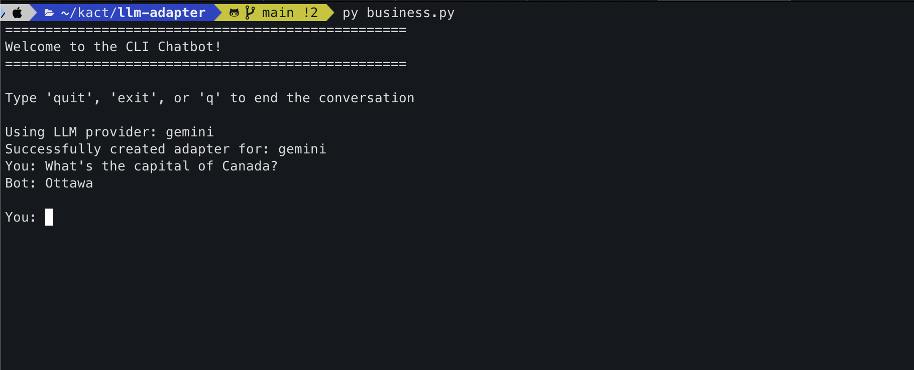

# LLM Adapter

A simple CLI chatbot that provides concise one-line answers using LLM with LangChain.

### Features

- One-line answer mode for quick, concise responses
- Conversation memory to maintain context
- Support for multiple LLM providers via factory pattern
- Easy-to-use command-line interface

### Usage

```bash
python business.py
```

Type your questions and get one-line answers. Type 'quit', 'exit', or 'q' to end the conversation.

### Requirements

See `requirements.txt` for dependencies.


### Screenshots
